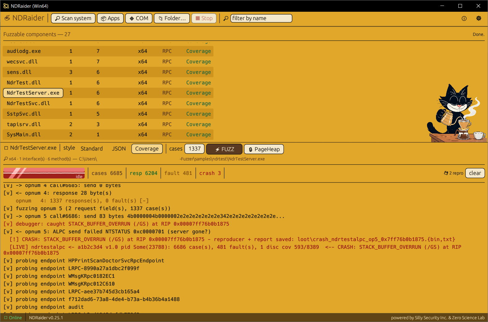

<p align="center">
  
</p>

<div align="center">

$\Large\textsf{\color{#C8901E} Windows RPC / DCOM / COM Fuzzer}$

</div>

<p align="center">
  
</p>

**Static NDR (Network Data Representation) grammar extraction -> structure-aware,
authenticated Windows RPC (Remote Procedure Call) / DCOM (Distributed Component
Object Model) / COM fuzzing.**

<sub>New to the jargon? Every abbreviation is spelled out in the
[Terminology](#terminology) glossary below.</sub>

[](#building)
[](#license)
[](#requirements)
[](#architecture)

NDRaider pulls Microsoft RPC/DCOM interface definitions **straight out of a PE
(Portable Executable - a Windows `.dll`/`.exe`) on disk** - no running process, no
source, no type library - decodes each method's full NDR parameter layout, turns
it into a machine-readable **fuzzing grammar**, and can then generate
**structure-aware, NTLM (NT LAN Manager) - authenticated RPC requests** and fire
them at a live endpoint.

Think of it as a modern, open-source successor to ComRaider: same core idea
(introspect the interface, mutate the arguments, watch for crashes) rebuilt for
today's DCOM/RPC surface with static binary analysis and a real authenticated
wire protocol.

> Powered by **[Silly Security Inc.](https://sillysec.com)** &
> **[Zero Science Lab](https://zeroscience.mk)**.

---

## Table of contents

- [Terminology](#terminology)
- [Why](#why)
- [What it does](#what-it-does)
- [How it works](#how-it-works)
- [Requirements](#requirements)
- [Building](#building)
- [Quick start](#quick-start)
- [Usage](#usage)
  - [`ndr-cli scan`](#ndr-cli-scan)
  - [`ndr-cli sweep`](#ndr-cli-sweep)
  - [`ndr-cli grammar`](#ndr-cli-grammar)
  - [`ndr-cli dump-types`](#ndr-cli-dump-types)
  - [`ndr-fuzz list`](#ndr-fuzz-list)
  - [`ndr-fuzz gen`](#ndr-fuzz-gen)
  - [`ndr-fuzz campaign`](#ndr-fuzz-campaign)
  - [`ndr-fuzz alpc-list`](#ndr-fuzz-alpc-list)
  - [`ndr-fuzz alpc-owner`](#ndr-fuzz-alpc-owner)
  - [`ndr-fuzz cov-fuzz`](#ndr-fuzz-cov-fuzz)
  - [`ndr-fuzz hail-mary`](#ndr-fuzz-hail-mary)
- [Fuzzing local services over ncalrpc](#fuzzing-local-services-over-ncalrpc)
- [Examples & recipes](#examples--recipes)
- [The fuzzing grammar](#the-fuzzing-grammar)
- [GUI (ndr-gui)](#gui-ndr-gui)
- [Binary Ninja plugin](#binary-ninja-plugin)
- [Validating locally](#validating-locally-the-test-corpus)
- [Architecture](#architecture)
- [Safety, ethics & legal](#safety-ethics--legal)
- [Roadmap](#roadmap)
- [Known limitations](#known-limitations)
- [Contributing](#contributing)
- [Acknowledgements](#acknowledgements)
- [License](#license)

---

## Terminology

Everything this tool touches, spelled out once. Skim it and the rest of the README
reads plainly.

| Term | Stands for | What it is |
|------|------------|------------|
| **RPC** | Remote Procedure Call | Microsoft's mechanism for calling a function that lives in another process (or machine) as if it were local. The thing we fuzz. |
| **DCOM** | Distributed Component Object Model | Object-oriented RPC - COM objects invoked across process/host boundaries. Built on RPC. |
| **NDR** | Network Data Representation | The wire format RPC uses to serialize ("marshal") arguments. **NDR64** is its 64-bit variant. |
| **MIDL** | Microsoft Interface Definition Language (compiler) | Compiles an `.idl` interface description into C stubs - and embeds the **NDR format strings** (a bytecode describing every parameter) into the binary. NDRaider reads those back out. |
| **IDL** | Interface Definition Language | The `.idl` source that declares an RPC interface's methods and types. |
| **PE** | Portable Executable | The Windows binary format - `.dll`, `.exe`, `.sys`, etc. NDRaider analyzes these on disk. |
| **stub** | - | The auto-generated marshaling code (and the raw serialized argument bytes on the wire). |
| **opnum** | operation number | The index of a method within an interface (method #0, #1, ...). How you pick what to call/fuzz. |
| **UUID / GUID** | (Universally / Globally) Unique Identifier | The 128-bit id that names an RPC interface (e.g. `8eefa2e8-...`). |
| **ALPC** | Advanced Local Procedure Call | The kernel's fast local IPC (inter-process communication) mechanism. |
| **LRPC / ncalrpc** | Local RPC (over ALPC) | RPC that stays on one machine, carried over ALPC. `ncalrpc` is its protocol-sequence name. Most Windows/vendor services listen here. |
| **ncacn_ip_tcp / ncacn_np** | network computing arch. connection: IP/TCP · named pipe | The RPC "protocol sequences" for RPC over TCP and over a named pipe. |
| **epmapper** | endpoint mapper | The RPC "phone book" service that maps an interface UUID to the port/pipe it's served on. |
| **NTLM** | NT LAN Manager | A Windows authentication protocol. Most `ncacn` endpoints won't run your call until you authenticate; NDRaider does the NTLM handshake itself. |
| **SSPI** | Security Support Provider Interface | The Windows API NDRaider uses to drive NTLM. |
| **PKT_INTEGRITY / PKT_PRIVACY** | packet integrity / privacy | RPC authentication levels: integrity = requests are **signed**; privacy = also **encrypted (sealed)**. |
| **context handle** | - | A server-issued token representing per-client state. Handle-gated methods reject calls without a valid one - NDRaider mints one via an "opener" method and chains it in. |
| **WOW64** | Windows 32-bit On Windows 64-bit | The subsystem that runs 32-bit processes on 64-bit Windows. Relevant to the coverage debugger (see [limitations](#known-limitations)). |
| **basic block** | - | A straight-line run of instructions with one entry and one exit - the unit of **code coverage** the fuzzer tracks. |
| **/GS** | (buffer security check) | MSVC's stack-cookie protection; when a fuzzed input smashes a stack buffer, `/GS` trips and the debugger catches it. |
| **RIP / EIP** | instruction pointer (x64 / x86) | The CPU register holding the current instruction address - reported at a crash. |
| **DBI** | Dynamic Binary Instrumentation | Frameworks like TinyInst/WinAFL that add coverage at runtime. NDRaider needs none - it ships its own debugger. |
| **cdylib / FFI / ABI** | C-dynamic library / Foreign Function Interface / Application Binary Interface | How the Rust core is exposed as a C-callable `.dll` so the Python Binary Ninja plugin can share it. |

## Why

Windows RPC (Remote Procedure Call) / DCOM (Distributed Component Object Model) is
a huge, historically bug-rich attack surface, but the open-source tooling for
exploring it is thin:

- **RpcView** and **OleViewDotNet** are excellent, but they reconstruct interface
  information from a **running process** and are GUI/closed or .NET-heavy.
- Fuzzing effort over the last decade went into browsers and file formats, not
  the RPC/NDR surface.

There is no good open, **static**, disassembler-agnostic tool that:

1. Extracts each RPC method's parameter/type structure directly from a PE on
   disk, and
2. Emits that structure as a grammar you can drive a **coverage-/structure-aware
   fuzzer** with.

NDRaider is that tool.

## What it does

- 🔎 **Finds RPC interfaces** in any PE (DLL/EXE) by scanning for the NDR / NDR64
  transfer-syntax GUID that MIDL embeds in every stub, recovering interface
  UUIDs and versions.
- 🧩 **Decodes the NDR format strings** - the compact bytecode MIDL emits to
  describe every parameter - into a structured, typed model: base types,
  pointers, structs, conformant/varying arrays, unions, strings, ranges,
  interface pointers, context handles, user-marshalled types, and the
  `size_is`/`length_is` correlations that link array lengths to other fields.
- 📜 **Emits a fuzzing grammar** (JSON) per interface: each method's request and
  response fields, with array-length dependencies resolved so a fuzzer can keep
  them consistent (to reach deep code) or deliberately desync them (to find
  bugs).
- 🎯 **Generates and sends structure-aware requests** over three transports -
  `ncacn_ip_tcp`, local named pipes (`ncacn_np`), and **local `ncalrpc`/LRPC over
  ALPC** - with **NTLM authentication** (PKT_INTEGRITY signing) where needed, and
  classifies each result as response / fault (with status) / crash.
- 🔗 **Reaches deep, stateful surfaces**: enumerates live ALPC endpoints
  (`\RPC Control`), and does **context-handle chaining** - calls an "opener"
  method to mint a real context handle and feeds it into handle-gated methods, so
  the fuzzer reaches handler code that a null handle would bounce off of.
- 🧭 **Coverage-guided, with a built-in debugger**: **spawns or attaches** to the
  target under its own from-scratch Windows debugger (no TinyInst/WinAFL),
  instruments **every basic block** (of the main image or a named DLL) with
  one-shot breakpoints, and steers mutation toward inputs that reach **new code** -
  catching crashes precisely (faulting instruction + access type + the exact
  reproducing input) and telling a genuine memory-safety crash apart from a benign
  RPC fault. On detach it restores breakpoints, leaving the service running.
  Block instrumentation targets **x64** images; **32-bit (WOW64)** targets are
  attached for **crash-detection only** (software breakpoints on the emulation
  boundary corrupt a WOW64 thread, so coverage is disabled there by design - see
  [Known limitations](#known-limitations)).
- 🧬 **COM/DCOM object fuzzing**: enumerate the local COM class surface
  (`com-list`) and fuzz an out-of-process (DCOM) object's `IDispatch` methods
  with mutated `VARIANT` arguments (`com-fuzz`) - a crash surfaces safely as a
  server-death HRESULT, never taking down the fuzzer. A far less-audited surface
  than RPC. **OPC-aware**: `com-list --opc` flags OPC (DA/HDA/AE) DCOM servers -
  the industrial-automation surface - by matching their component categories.
- 🗺️ **Endpoint-mapper enumeration** (`epmapper`): query the RPC endpoint mapper
  (local or remote `--host`) to map each registered interface UUID to its live
  binding/endpoint and annotation - the RPC "phone book", for discovering reachable
  targets.
- 🛡️ **PageHeap / Application Verifier** (`pageheap`): toggle Full PageHeap on a
  target image so **heap overflows fault immediately** (guard page after every
  allocation) instead of silently corrupting memory - turning latent bugs into
  crashes the debugger catches. The single biggest lever for actually *finding*
  memory-safety bugs.
- 🚀 **Autopilot** (`hail-mary`): one command enumerates a target, identifies
  every interface, builds a corpus, discovers live ncalrpc endpoints,
  bind-matches them, resolves each owner PID, coverage-fuzzes the matches, catches
  crashes, and writes a report.
- 🧠 **Annotates Binary Ninja** (optional plugin): names each
  `RPC_SERVER_INTERFACE` and renames/comments the recovered server handler
  functions with their decoded signatures.

Everything is validated end-to-end against MIDL-compiled ground truth and real
Windows services (`rpcss.dll`, `combase.dll`, `spoolsv.exe`, ...).

## How it works

```
        PE on disk (.dll / .exe)
                │
                ▼
   ┌─────────────────────────────┐
   │ ndr-core                    │
   │  • PE loader                │
   │  • interface locator        │   interface UUID + version
   │  • NDR format-string        │   per-method typed parameter model
   │    interpreter              │
   │  • grammar emitter          │   structure-aware fuzzing grammar (JSON)
   └─────────────────────────────┘
        │            │            │
        ▼            ▼            ▼
   ndr-cli      bn-plugin      ndr-fuzz
   (scan /      (annotate      (generate → marshal → mutate → sign →
    grammar /    interfaces &   deliver over TCP / named pipe (NTLM) or
    sweep /      handlers)      ncalrpc/LRPC (+context-handle chaining) →
    dump-types)                 classify response / fault / crash)
```

The core is a single Rust library (`ndr-core`) exposed both as a normal crate
and as a C ABI (`cdylib`), so the CLI, the fuzzer, and the Python Binary Ninja
plugin all share exactly one implementation of the tricky NDR interpreter.

## Requirements

- **Windows** (the live fuzzer and the test harness use Windows RPC; static
  analysis itself is portable).
- **Rust** toolchain (stable). Install via [rustup](https://rustup.rs).
- **Optional**, only to (re)build the local test corpus / server: **Visual
  Studio Build Tools** (MSVC `cl`) and the **Windows SDK** (`midl`).
- **Optional**, for the plugin: **Binary Ninja** Personal edition or higher
  (the Free edition disables plugins).

## Building

```sh
git clone https://github.com/zeroscience/NDRaider
cd NDRaider
cargo build --release
```

Binaries land in `target/release/`:

- `ndr-cli.exe` - static analysis (scan / grammar / dump-types)
- `ndr-fuzz.exe` - request generation + live fuzzing
- `ndr_core.dll` - the shared core library (used by the Binary Ninja plugin)

## Quick start

```sh
# 0. Triage a whole directory to find the RPC servers worth looking at
ndr-cli sweep C:\Windows\System32 --min 3

# 1. See which RPC interfaces and methods live in a binary
ndr-cli scan C:\Windows\System32\rpcss.dll

# 2. Get the decoded fuzzing grammar as JSON
ndr-cli grammar C:\Windows\System32\rpcss.dll > rpcss.grammar.json

# 3. Generate request buffers for one method (offline, writes hex to stdout)
ndr-fuzz list  C:\Windows\System32\rpcss.dll
ndr-fuzz gen   C:\Windows\System32\rpcss.dll --opnum 0 --count 8

# ...or skip all of that: ONE command that enumerates, builds a corpus, and
# (with --live) discovers live endpoints, fuzzes them, catches crashes, reports.
ndr-fuzz hail-mary "C:\Program Files\SomeVendor" --out .\loot            # safe
ndr-fuzz hail-mary "C:\Program Files\SomeVendor" --live --cov --i-am-authorized --out .\loot
```

> Live fuzzing (sending to a real endpoint) is **opt-in** and gated behind
> `--i-am-authorized`. See [Safety](#safety-ethics--legal).

## Usage

> **Progress + verbose:** by default `ndr-fuzz` shows an animated one-line
> spinner during long phases (`bind-matching endpoints - 120/298 probed`,
> `fuzzing opnum 2 - case 340/500`), so it never looks hung. It's auto-disabled
> when output is piped/redirected. Add `-v` / `--verbose` for full narration
> instead - endpoints probed, matches, `debugger: attached to pid ...`,
> `instrumented N basic blocks`, and each request as `-> opnum N call#K: send B
> bytes <hex>` / `<- response|FAULT`. (`NDR_COV_DEBUG=1` additionally prints every
> raw exception the debugger sees.)

### `ndr-cli scan`

Locate RPC interfaces and print decoded method signatures.

```sh
ndr-cli scan <path> [--json] [--pretty]
```

| Option | Description |
|--------|-------------|
| `<path>` | PE file (.dll / .exe) to analyze |
| `--json` | Emit the full report as JSON instead of a human summary |
| `--pretty` | With `--json`, pretty-print |

Human output looks like:

```
[ 7] 99fcfec4-5260-101b-bbcb-00aa0021347a  v0.0        (IObjectExporter / OXID resolver)
     transfer=Ndr  section=.rdata  struct@0x0010c1b0 (len 0x60)
     procedures: 5
       [ 0] proc([in] FC_BOGUS_STRUCT*, [out] FC_BOGUS_STRUCT*, [in] long) -> long
       ...
```

### `ndr-cli sweep`

Recursively triage a **whole directory** - find every PE that hosts RPC/MIDL
stubs, ranked by interface count. Great for "which binaries in `System32` are
RPC servers worth looking at?"

```sh
ndr-cli sweep <dir> [--ext <list>] [--all-files] [--methods] [--min <N>] [--json]
```

| Option | Default | Description |
|--------|---------|-------------|
| `<dir>` | - | Directory to walk (recursively; symlinks not followed) |
| `--ext <list>` | `dll,exe,sys,ocx,cpl,drv,acm,efi` | Comma-separated extensions to consider |
| `--all-files` | off | Try every file regardless of extension (slower) |
| `--methods` | off | Also decode + count methods per file (slower) |
| `--min <N>` | `1` | Only report files with ≥ N interfaces |
| `--json` | off | Machine-readable output |

```
$ ndr-cli sweep C:\Windows\System32 --min 3
Swept C:\Windows\System32 - 7014 PE file(s) scanned, 229 with >= 3 interface(s)

INTERFACES  METHODS  ARCH  PATH
        41        -  x64   C:\Windows\System32\OneCoreUAPCommonProxyStub.dll
        19        -  x64   C:\Windows\System32\rpcss.dll
        18        -  x64   C:\Windows\System32\comsvcs.dll
        13        -  x64   C:\Windows\System32\spoolsv.exe
        ...
```

Non-PE and unreadable files are skipped silently. Pick a target from the list,
then `ndr-cli scan` / `ndr-cli grammar` it for detail.

### `ndr-cli grammar`

Emit the structure-aware fuzzing grammar (JSON) for every interface that has
decoded methods.

```sh
ndr-cli grammar <path> [--compact]
```

| Option | Description |
|--------|-------------|
| `--compact` | Single-line JSON instead of pretty-printed |

### `ndr-cli dump-types`

Diagnostic: dump the raw NDR type format string (offset -> opcode) per interface.
Useful when validating the interpreter against a new binary.

```sh
ndr-cli dump-types <path> [--interface N] [--len L]
```

| Option | Description |
|--------|-------------|
| `--interface N` | Only dump the interface at index `N` (default: all) |
| `--len L` | Max bytes to dump per interface (default: 256) |

### `ndr-fuzz list`

List the interfaces and methods available to fuzz in a PE.

```sh
ndr-fuzz list <path>
```

### `ndr-fuzz gen`

Generate structure-aware request buffers for one method - and optionally send
them to a live endpoint.

```sh
ndr-fuzz gen <path> --opnum <N> [options]
```

| Option | Default | Description |
|--------|---------|-------------|
| `<path>` | - | PE to derive the grammar from |
| `--opnum <N>` | - | Method (opnum) to fuzz (**required**) |
| `--interface <I>` | `0` | Interface index (see `list`) |
| `--count <K>` | `8` | Number of fuzz cases |
| `--seed <S>` | `0` | PRNG seed (reproducible) |
| `--out <DIR>` | - | Write each case to `DIR/op<N>_<i>.bin` instead of hex to stdout |
| `--target <host:port>` | - | **Live**: send over `ncacn_ip_tcp` |
| `--pipe <\pipe\name>` | - | **Live**: send over a local `ncacn_np` named pipe |
| `--auth` | off | Authenticate the bind with NTLM (PKT_INTEGRITY) - required to reach handler code on most endpoints |
| `--timeout-ms <MS>` | `3000` | Per-request timeout (TCP) |
| `--i-am-authorized` | off | **Required** to send any live traffic |

Examples:

```sh
# Offline: dump 16 mutated request buffers as hex
ndr-fuzz gen target.dll --opnum 3 --count 16 --seed 42

# Offline: write cases to files for replay / offline analysis
ndr-fuzz gen target.dll --opnum 3 --out .\cases

# Live over TCP with NTLM auth (authorized targets only!)
ndr-fuzz gen target.dll --opnum 3 --target 127.0.0.1:49152 --auth --i-am-authorized

# Live over a local named pipe
ndr-fuzz gen target.dll --opnum 3 --pipe \pipe\mypipe --auth --i-am-authorized
```

The generator is **structure-aware**: it biases scalars toward boundary values
(`0`, `1`, `-1`, `INT_MAX`, `INT_MIN`, high bit), and for `size_is`/`length_is`
arrays it **keeps the length field consistent ~70% of the time** (to reach deep
code) and **deliberately desyncs it the rest** (to stress allocation/overflow
paths). Runs are reproducible from `--seed`.

### `ndr-fuzz campaign`

Automate the whole pipeline - sweep/scan a file or directory, then **generate
(offline)** or **fuzz (live)** *every method of every interface* automatically.

```sh
ndr-fuzz campaign <path> [--count K] [--seed S] [--min N] [--out DIR]
                         [--target host:port | --pipe \pipe\name | --alpc endpoint]
                         [--auth] [--consistent] [--i-am-authorized]
```

| Option | Default | Description |
|--------|---------|-------------|
| `<path>` | - | A PE file, or a directory to walk recursively |
| `--count <K>` | `32` | Fuzz cases per method |
| `--seed <S>` | `0` | Seed base (each method gets a derived, reproducible seed) |
| `--min <N>` | `1` | Directory mode: skip binaries with fewer interfaces |
| `--out <DIR>` | - | **Offline**: write a fuzz-case corpus tree here |
| `--target` / `--pipe` | - | **Live**: bind + auto-fuzz every method (single server) |
| `--alpc <endpoint>` | - | **Live**: fuzz a local `ncalrpc`/ALPC endpoint (see [`alpc-list`](#ndr-fuzz-alpc-list)); no `--auth` needed |
| `--auth` | off | Authenticate live binds (NTLM PKT_INTEGRITY) - ncacn only |
| `--consistent` | off | Content-fuzz: keep every `size_is`/`length_is` consistent so buffers pass unmarshal and reach the handler; mutate contents, not lengths |
| `--i-am-authorized` | off | Required for any live traffic |

- **Offline** (no target): sweeps the path, and for each RPC-hosting binary ->
  interface -> method, writes cases to
  `DIR/<binary>/<uuid>/op<N>/case_<i>.bin`.
- **Live** (with `--target`/`--pipe`/`--alpc`): binds each interface once and
  fuzzes all its opnums, tallying faults and **flagging disconnects as possible
  crashes**. Over `--alpc` it also **chains context handles** automatically and
  reports a per-opnum response/fault breakdown (with status codes, so `0x5`
  access-denied is distinct from `0x6f7` bad-stub-data or `0x6` invalid-handle).

```sh
# Offline: turn a whole directory into a fuzz-case corpus
ndr-fuzz campaign C:\Windows\System32 --min 3 --count 50 --out .\corpus

# Live: auto-fuzz every method of one server (authorized targets only)
ndr-fuzz campaign target.dll --pipe \pipe\itsname --auth --i-am-authorized

# Live over local ncalrpc, then go deep with content-fuzzing
ndr-fuzz campaign target.dll --alpc SomeRpcEndpoint --i-am-authorized
ndr-fuzz campaign target.dll --alpc SomeRpcEndpoint --consistent --count 500 --i-am-authorized
```

### `ndr-fuzz alpc-list`

List the ALPC ports in the `\RPC Control` object directory - i.e. the **live
`ncalrpc` endpoint names** you can point `campaign --alpc` at. Endpoint names are
often dynamic (`Name.<randomhex>`), so guessing rarely works; this enumerates
them directly.

```sh
ndr-fuzz alpc-list [filter] [--all]
```

| Option | Description |
|--------|-------------|
| `[filter]` | Case-insensitive substring to match port names (e.g. `lenovo`) |
| `--all` | Show every object type, not just `ALPC Port` entries |

```
$ ndr-fuzz alpc-list vantage
VantageCoreAddin.1c0aabd7474247c59a1c832e0d6980cf  [ALPC Port]
[alpc] 1 port(s) shown of 1 directory entry matching "vantage"
```

### `ndr-fuzz alpc-owner`

Resolve **which process serves** an ncalrpc endpoint (via
`NtAlpcQueryInformation`) - the PID to point `cov-fuzz --attach` at.

```sh
ndr-fuzz alpc-owner <endpoint>
```

```
$ ndr-fuzz alpc-owner VantageCoreAddin.1c0aabd7474247c59a1c832e0d6980cf
VantageCoreAddin.1c0a... is served by PID 22180
```

### `ndr-fuzz cov-fuzz`

**Coverage-guided** fuzzing with a built-in debugger. NDRaider spawns the server
EXE under its own Win32 debug loop, writes a one-shot breakpoint at **every basic
block** (found by disassembling the code with `iced-x86`), and steers mutation
toward inputs that light up **new** blocks. Because it *is* the debugger, it
catches crashes precisely - the faulting instruction, the access type, and the
exact request that did it - and distinguishes a real memory-safety crash from a
benign first-chance RPC fault the runtime handles.

```sh
ndr-fuzz cov-fuzz <grammar.pe> --alpc <endpoint>
                  (--spawn <server.exe> | --attach <pid>)
                  [--module <dll> --module-pe <path>] [options] --i-am-authorized
```

| Option | Default | Description |
|--------|---------|-------------|
| `<grammar.pe>` | - | PE to derive the interface/grammar from (the server EXE or its DLL) |
| `--alpc <endpoint>` | - | ncalrpc endpoint the server listens on (**required**) |
| `--spawn <exe>` | - | Target mode A: spawn this server EXE under the debugger |
| `--attach <pid>` | - | Target mode B: attach to an already-running PID |
| `--module <dll>` | - | Instrument this DLL (by file name) instead of the main image |
| `--module-pe <path>` | - | On-disk PE of the instrumented module (defaults to `--spawn` EXE; required for `--module`/`--attach`) |
| `--count <K>` | `3000` | Total fuzz iterations |
| `--seed <S>` | `0` | PRNG seed (reproducible) |
| `--out <DIR>` | - | Save a crash reproducer (the exact stub) here if one is found |
| `--i-am-authorized` | off | **Required** - this spawns/attaches and hammers a live server |

```
$ ndr-fuzz cov-fuzz NdrTest.dll --alpc ndrtestalpc --spawn NdrTestServer.exe --count 6000 --out .\crashes --i-am-authorized
[cov] instrumented 8389 basic blocks; waiting for the server to listen...
[cov] bound a1b2c3d4-... v1.0 - fuzzing 6 method(s)
[cov] done: 1349/8389 blocks covered (384 gained during fuzzing), 5 coverage-increasing inputs

!!! CRASH CAUGHT: STACK_BUFFER_OVERRUN (/GS) at RIP 0x00007ff7d3011875
    opnum 5, 264-byte stub: 000100000001000080000100...
    reproducer written to .\crashes\crash_op5_0x7ff7d3011875.bin
```

Three target modes:

```sh
# A) spawn + instrument the main image (self-contained EXE server)
ndr-fuzz cov-fuzz NdrTest.dll --alpc ndrtestalpc --spawn NdrTestServer.exe --i-am-authorized

# B) attach to an already-running process (the real-service shape). On detach we
#    restore every un-hit breakpoint, so the service keeps running untouched.
ndr-fuzz cov-fuzz NdrTest.dll --alpc ndrtestalpc --attach 4321 \
    --module-pe C:\path\Server.exe --i-am-authorized

# C) cover a DLL-hosted interface (host.exe -> LoadLibrary(Server.dll)) - what
#    most vendor services look like.
ndr-fuzz cov-fuzz NdrTest.dll --alpc ndrtestdll --spawn Host.exe \
    --module Server.dll --module-pe C:\path\Server.dll --i-am-authorized
```

Coverage-fuzzing a **real, already-running local service** end to end - find the
PID serving the endpoint, then attach and instrument its RPC-server DLL:

```sh
# Which process serves this ncalrpc endpoint?
ndr-fuzz alpc-owner VendorCoreAddin.1c0a...
#   VendorCoreAddin.1c0a... is served by PID 4321

# Attach to it and cover its (possibly 32-bit) RPC server DLL:
ndr-fuzz cov-fuzz "C:\...\VendorRpcServer.dll" --alpc VendorCoreAddin.1c0a... \
    --attach 4321 --module VendorRpcServer.dll \
    --module-pe "C:\...\VendorRpcServer.dll" --i-am-authorized
```

> **x64 targets** get full basic-block coverage. **32-bit (WOW64) targets** are
> attached for **crash-detection only** - injecting software breakpoints into a
> 32-bit module corrupts the WOW64 CPU transition and crashes the process, so
> block instrumentation is disabled for WOW64 by design (the fuzzer still catches
> genuine crashes on those targets, just without coverage feedback). Attaching to
> a process owned by another user or a **SYSTEM** service needs an elevated
> `ndr-fuzz` (`SeDebugPrivilege`). On detach we restore every un-hit breakpoint,
> so the service keeps running. Set `NDR_COV_DEBUG=1` to print every exception the
> debugger sees.

**When a crash is caught** (with `--out`), NDRaider writes two files:
`crash_..._op<N>_<rip>.bin` (the exact request stub) and `.txt` (a report with the
faulting instruction as `module+0xRVA`, registers, a stack dump, and a naive
backtrace of return addresses into the module). Reproduce it deterministically -
including with **no debugger attached**, which proves the crash is a real input bug
and not an instrumentation artifact:

```sh
ndr-fuzz replay <server.dll|exe> --alpc <endpoint> --opnum <N> \
    --file crash_..._op<N>_<rip>.bin --count 1 --i-am-authorized
#   #0: ALPC send failed NTSTATUS 0x... - SERVER LIKELY CRASHED/GONE   <- reproduced
```

### `ndr-fuzz hail-mary`

**Autopilot.** One command runs the whole pipeline: enumerate a file/dir ->
identify every interface -> write an offline corpus -> (live) discover ncalrpc
endpoints, **bind-match** them to the discovered interfaces, resolve each owner
PID, fuzz the matches (optionally coverage-instrumented), catch crashes, and
write a Markdown report.

```sh
ndr-fuzz hail-mary <path> [--out DIR] [--live] [--cov] [--count N] [--min N] [--i-am-authorized]
```

| Option | Default | Description |
|--------|---------|-------------|
| `<path>` | - | A PE file, or a directory to enumerate recursively |
| `--out <DIR>` | `.` | Where to write `ndr-hailmary-report.md` (and, with a corpus, the cases) |
| `--live` | off | Also discover live ncalrpc endpoints, bind-match, and fuzz them (**needs `--i-am-authorized`**) |
| `--cov` | off | With `--live`: attach a coverage debugger to each matched endpoint's server (best-effort) |
| `--json` | off | JSON-over-RPC mode: fill `byte[]` buffers with fuzzed JSON (see below) |
| `--seeds <DIR>` | - | Directory of example JSON requests to mutate (best with `--json`) |
| `--count <K>` | `32` | Cases per method (live); corpus cases per method (offline, capped at 16) |
| `--min <N>` | `1` | Directory mode: skip binaries with fewer interfaces |
| `--i-am-authorized` | off | Required for any live traffic |

```sh
# Safe: enumerate + build an offline corpus + report (sends nothing)
ndr-fuzz hail-mary "C:\Program Files\Vendor" --out .\loot

# Full autopilot against a live target (authorized!): discover -> match ->
# coverage-fuzz -> catch -> report
ndr-fuzz hail-mary "C:\Program Files\Vendor" --live --cov --i-am-authorized --out .\loot
```

The live report is a table per matched endpoint:

```
| endpoint     | interface | pid  | cases | faults | disconnects | coverage  | crash                              |
| ndrtestalpc  | a1b2c3d4  | 7716 | 301   | 21     | 1           | 595/8389  | STACK_BUFFER_OVERRUN (/GS) at ...  |
```

> `hail-mary` ties together `scan`/`sweep`/`grammar`/`gen`/`alpc-list`/
> `alpc-owner`/`campaign`/`cov-fuzz`. It only tries interfaces it extracted from
> `<path>`, so scope `<path>` to the vendor you're testing. Coverage attach is
> best-effort (skipped where privilege/module don't line up); the ncalrpc fuzz
> still runs and flags disconnects as possible crashes.

**JSON-over-RPC (`--json`).** Many services (e.g. Lenovo Vantage) carry a JSON
command *inside* an RPC `byte[]` buffer. Raw byte mutation just yields invalid
JSON the handler rejects; `--json` instead fills those buffers with a **fuzzed but
valid JSON document** (SQLi / path-traversal / template-injection / overlong
payloads in the field values), so requests reach the **command handlers** - the
layer where injection and logic bugs live - rather than bouncing off the parser.
Add `--seeds <dir>` with real captured JSON requests to mutate those instead of
synthesizing. `cov-fuzz` takes `--json`/`--seeds` too.

### COM/DCOM object fuzzing (`com-list` / `com-fuzz`)

RPC is only part of the local IPC surface - registered **COM/DCOM** objects are a
large, far less-audited one. Enumerate them, then fuzz an out-of-process object's
dispatch methods:

```sh
# List instantiable COM classes (out-of-process = DCOM), filter by name/path
ndr-fuzz com-list --local
ndr-fuzz com-list --local vantage        # substring filter (name / ProgID / server path)
ndr-fuzz com-list --local --json         # machine-readable (used by the GUI)

# Fuzz a DCOM object's IDispatch methods with mutated VARIANT args (authorized!)
ndr-fuzz com-fuzz "{CLSID-or-ProgID}" --count 300 --i-am-authorized
```

`com-fuzz` `CoCreateInstance`s the class **out-of-process** and hammers its
`IDispatch::Invoke` with fuzzed `VARIANT`s (ints, doubles, booleans, and nasty
dictionary `BSTR`s). Because the object runs in its own server process, a crash
shows up as a **server-death HRESULT** (`RPC_S_SERVER_UNAVAILABLE`, …) and is
reported - it never crashes the fuzzer. (In-proc classes are refused by default;
`--allow-inproc` opts in, at the risk of crashing the fuzzer's own process.)

### Make bugs crash: PageHeap (`pageheap`)

A latent heap overflow often corrupts a few bytes and **never faults** - so blind
fuzzing finds "nothing". Full PageHeap puts each allocation against a guard page,
so any overrun **crashes immediately**, and the coverage debugger catches it.

```sh
ndr-fuzz pageheap TargetService.exe            # enable Full PageHeap (needs elevation)
ndr-fuzz pageheap TargetService.exe --status   # is it on?
ndr-fuzz pageheap TargetService.exe --off       # disable
```

Enable it, **restart the target** (or its service) so it relaunches under
page-heap, then fuzz. Pair with `appverif.exe` (Application Verifier) for heap /
handle / lock checks. Both ship with the Windows SDK's Debugging Tools.

## Fuzzing local services over ncalrpc

Most real Windows services (and third-party agents) listen on **`ncalrpc`** -
local RPC over ALPC - not TCP. NDRaider speaks LRPC directly (it builds the
undocumented LRPC bind/request messages over `NtAlpc*` syscalls), so you can go
from "a DLL on disk" to "fuzzing a live local service" without any network setup.
Unlike ncacn, **LRPC binds implicitly under your token, so no `--auth` is needed**.

The full workflow:

```sh
# 1) The service's RPC server lives in some DLL/EXE. Find its interface + methods.
#    (Scan the *server* binary - a matching client DLL often decodes only partially.)
ndr-cli scan  "C:\Program Files\Vendor\App\VendorRpcServer.dll"
ndr-fuzz list "C:\Program Files\Vendor\App\VendorRpcServer.dll"

# 2) Find the live endpoint name (they're often dynamic, so don't guess).
ndr-fuzz alpc-list vendor

# 3) Sanity-check reachability, then bind the interface.
ndr-fuzz alpc-ping  VendorCoreAddin.1c0a...
ndr-fuzz alpc-bind  VendorCoreAddin.1c0a...  "C:\Program Files\Vendor\App\VendorRpcServer.dll"

# 4) Fuzz every method. Context handles are chained automatically.
ndr-fuzz campaign "C:\Program Files\Vendor\App\VendorRpcServer.dll" \
    --alpc VendorCoreAddin.1c0a... --count 100 --i-am-authorized

# 5) Go deep: keep lengths consistent so buffers reach the handler, fuzz contents.
ndr-fuzz campaign "C:\Program Files\Vendor\App\VendorRpcServer.dll" \
    --alpc VendorCoreAddin.1c0a... --consistent --count 500 --seed 1 --i-am-authorized
```

Reading the per-opnum output:

```
[ctx] opnum 0 is an opener - chaining its handle into handle-gated methods
opnum   0: 100 response(s), 0 fault(s) [-]              # opener - runs fine
opnum   1 (ctx): 1 response(s), 99 fault(s) [0x6x99]    # a Close: works once, then INVALID_HANDLE
opnum   2 (ctx): 64 response(s), 36 fault(s) [0x6f7x36] # reaching the handler; faults are size_is desyncs
```

`(ctx)` marks a method that was handed a live context handle. Fault status codes
tell you *why* a call bounced: `0x5` = access denied (caller gate), `0x6f7` =
bad stub data (NDR desync), `0x6` = invalid handle. A **disconnect** (the ALPC
send failing) is flagged as a possible crash.

## Examples & recipes

A copy-paste cookbook. Static analysis is always safe; anything that sends
network/RPC traffic is called out and needs `--i-am-authorized`.

### Discover & triage

```sh
# Triage an entire directory, ranked by interface count
ndr-cli sweep C:\Windows\System32 --min 3

# Only look at DLLs and EXEs; or try literally every file (slower)
ndr-cli sweep C:\MyApp --ext dll,exe
ndr-cli sweep C:\MyApp --all-files

# Also decode + count methods per file (slower, but great for prioritizing)
ndr-cli sweep C:\Windows\System32\wbem --methods

# Machine-readable, for piping into other tooling
ndr-cli sweep C:\Windows\System32 --json > rpc-hosts.json

# Non-default extensions (drivers, control panels, codecs ...)
ndr-cli sweep C:\Windows\System32\drivers --ext sys
```

### Inspect a single binary

```sh
# Human-readable interface + method list
ndr-cli scan C:\Windows\System32\rpcss.dll

# Full report as JSON (one line) or pretty-printed
ndr-cli scan C:\Windows\System32\rpcss.dll --json
ndr-cli scan C:\Windows\System32\rpcss.dll --json --pretty

# Save a JSON report for later diffing / tooling
ndr-cli scan C:\Windows\System32\combase.dll --json --pretty > combase.json
```

### Extract the fuzzing grammar

```sh
# Pretty JSON grammar for every interface with decoded methods
ndr-cli grammar C:\Windows\System32\rpcss.dll

# Compact (single line), e.g. to save or pipe
ndr-cli grammar C:\Windows\System32\rpcss.dll --compact > rpcss.grammar.json
```

### Diagnostics (raw NDR type strings)

```sh
# Dump the raw type format string (offset -> opcode) for every interface
ndr-cli dump-types C:\Windows\System32\rpcss.dll

# Just one interface, and more bytes
ndr-cli dump-types C:\Windows\System32\rpcss.dll --interface 0 --len 512
```

### Generate fuzz cases (offline - sends nothing)

```sh
# List the interfaces/methods you can target
ndr-fuzz list target.dll

# Print 16 mutated request buffers for opnum 3 as hex
ndr-fuzz gen target.dll --opnum 3 --count 16

# Reproducible run (same seed => identical output)
ndr-fuzz gen target.dll --opnum 3 --count 16 --seed 42

# A method on a different interface (see `list` for indices)
ndr-fuzz gen target.dll --interface 2 --opnum 5 --count 8

# Write each case to a .bin file (for replay / offline analysis)
ndr-fuzz gen target.dll --opnum 3 --count 100 --out .\cases
```

### Live fuzzing (authorized targets only)

```sh
# Over TCP, unauthenticated (usually only reaches the bind; see auth below)
ndr-fuzz gen target.dll --opnum 3 --target 127.0.0.1:49152 --i-am-authorized

# Over TCP with NTLM auth (PKT_INTEGRITY) - required to reach handler code
ndr-fuzz gen target.dll --opnum 3 --target 127.0.0.1:49152 --auth --i-am-authorized

# Over a local named pipe, authenticated
ndr-fuzz gen target.dll --opnum 3 --pipe \pipe\mypipe --auth --i-am-authorized

# Longer run with a custom per-request timeout (ms)
ndr-fuzz gen target.dll --opnum 3 --count 5000 --seed 1 ^
    --target 127.0.0.1:49152 --auth --i-am-authorized --timeout-ms 1000
```

### Live fuzzing over ncalrpc/ALPC (local services)

```sh
# Enumerate live local RPC endpoints (optionally filter by name)
ndr-fuzz alpc-list
ndr-fuzz alpc-list vantage

# Reachability + bind checks
ndr-fuzz alpc-ping SomeRpcEndpoint
ndr-fuzz alpc-bind SomeRpcEndpoint server.dll

# Auto-fuzz every method over ncalrpc (no --auth needed; handles auto-chained)
ndr-fuzz campaign server.dll --alpc SomeRpcEndpoint --count 100 --i-am-authorized

# Content-fuzz mode: buffers stay well-formed and reach the handler
ndr-fuzz campaign server.dll --alpc SomeRpcEndpoint --consistent --count 500 --i-am-authorized
```

### End-to-end workflow

```sh
# 1) find RPC servers in a directory
ndr-cli sweep C:\Program Files\SomeApp --methods

# 2) inspect the interesting one
ndr-cli scan "C:\Program Files\SomeApp\svc.dll"

# 3) see its methods and their fuzz surface
ndr-fuzz list "C:\Program Files\SomeApp\svc.dll"

# 4) fuzz a method (authorized target!)
ndr-fuzz gen "C:\Program Files\SomeApp\svc.dll" --opnum 4 ^
    --count 2000 --pipe \pipe\svc --auth --i-am-authorized
```

### Automate the whole thing (campaign)

```sh
# The end-to-end workflow above, in ONE command.

# Offline: sweep a directory and build a fuzz-case corpus for everything
ndr-fuzz campaign C:\Windows\System32 --min 3 --count 50 --out .\corpus

# Offline: just one binary's full corpus
ndr-fuzz campaign target.dll --count 100 --out .\corpus

# Live: auto-fuzz EVERY method of a server, flag disconnects as crashes
ndr-fuzz campaign target.dll --pipe \pipe\itsname --auth --i-am-authorized
ndr-fuzz campaign target.dll --target 127.0.0.1:49152 --auth --i-am-authorized
```

### Local test lab (fuzz your own server safely)

```sh
# Build the sample interface + a real RPC server (needs MIDL + cl)
samples\ndrtest\build.cmd
samples\ndrtest\build_server.cmd

# Start it (listens on ncacn_ip_tcp:49152 and \pipe\ndrtest)
samples\ndrtest\NdrTestServer.exe

# In another shell: fuzz it, authenticated. opnum 2 (SumArray) exercises the
# size_is desync - expect some faults, that's the mutation working.
ndr-fuzz gen samples\ndrtest\NdrTest.dll --opnum 2 --count 30 ^
    --pipe \pipe\ndrtest --auth --i-am-authorized
```

### Binary Ninja plugin checks (no Binary Ninja needed)

```sh
cargo build -p ndr-core
python bn-plugin/test_ffi.py       # FFI round-trip
python bn-plugin/test_render.py    # signature renderer vs. ground truth
python bn-plugin/test_plugin.py    # full plugin against a mock `binaryninja`
```

> On PowerShell, replace the `^` line-continuations with a backtick `` ` `` (or
> just put the whole command on one line).

## The fuzzing grammar

`ndr-cli grammar` produces, per interface, a list of methods; each method splits
its parameters into `request` (the `[in]`/`[in,out]` fuzz surface) and
`response` (`[out]`/return). Every field is a typed node, and array lengths are
resolved to a **source** so a harness knows what to keep consistent:

```jsonc
{
  "interface": "a1b2c3d4-1111-2222-3333-444455556666",
  "version": "1.0",
  "methods": [
    {
      "opnum": 2,
      "handler_rva": 4160,
      "request": [
        { "stack_offset": 8,  "dir": "in", "node": { "node": "int", "bytes": 4, "signed": true } },
        { "stack_offset": 16, "dir": "in", "node": {
            "node": "array",
            "element": { "node": "int", "bytes": 4, "signed": true },
            "length": { "from": "param", "stack_offset": 8 },   // ← ties to the count param
            "varying": false } }
      ],
      "response": [
        { "dir": "return", "node": { "node": "int", "bytes": 4, "signed": true } }
      ]
    }
  ]
}
```

Node kinds include `int`, `float`, `range`, `pointer`, `struct`, `array`,
`fixed_array`, `str`, `interface_ptr`, `context_handle`, `union`,
`user_marshal`, and `blob` (opaque/unresolved).

## GUI (`ndr-gui`)

Prefer clicking to typing? `crates/ndr-gui` is an optional [egui](https://github.com/emilk/egui)
desktop app that drives `ndr-cli` and `ndr-fuzz` for you - no flags to memorize:

1. **Sweep** a directory for RPC hosts (ranked by interface count), click one to
   select it as the target.
2. **Scan** it to list interfaces, versions, and methods.
3. Pick **what to do** - Hail-Mary (autopilot), Campaign (fuzz one ncalrpc
   endpoint), or Gen (offline buffers) - with sliders/checkboxes for count, seed,
   coverage, JSON-over-RPC, `--consistent`, and the `--i-am-authorized` gate.
4. Watch a live **pulse** waveform (green = responses, amber = faults, red =
   crashes), running stat chips, and the streamed output log; replay saved
   `crash_*.bin` reproducers with one click.

```sh
cargo build --release -p ndr-gui
target\release\ndr-gui.exe        # finds ndr-cli.exe / ndr-fuzz.exe beside it
```

Everything it does is just the CLI underneath (it shells out and streams the
output), so anything the GUI can do, the CLI can too - and the same
`--i-am-authorized` safety gate applies.

## Binary Ninja plugin

`bn-plugin/` calls the `ndr-core` cdylib over ctypes and annotates the current
BinaryView: it names each `RPC_SERVER_INTERFACE` and renames + comments the
recovered server handler functions with their decoded signatures.

Requires Binary Ninja **Personal** edition or higher (Free disables plugins).
The plugin's logic is fully testable **without** Binary Ninja via a mock harness:

```sh
python bn-plugin/test_ffi.py       # FFI round-trip
python bn-plugin/test_render.py    # renderer vs. ground truth
python bn-plugin/test_plugin.py    # full plugin against a mock `binaryninja`
```

See [`bn-plugin/README.md`](bn-plugin/README.md) for install steps.

## Validating locally (the test corpus)

`samples/ndrtest/` contains small `.idl` files and build scripts that compile a
known-interface DLL (and a matching RPC server) with MIDL + `cl`. Because the
answer is known, this is how the interpreter and the live fuzzer are validated
without pointing at system services:

```sh
samples\ndrtest\build.cmd          # MIDL stubs + NdrTest.dll
samples\ndrtest\build_server.cmd   # NdrTestServer.exe (tcp 49152 + \pipe\ndrtest)

# In another shell - fuzz our own server, authenticated:
ndr-fuzz gen samples\ndrtest\NdrTest.dll --opnum 2 --count 30 ^
    --pipe \pipe\ndrtest --auth --i-am-authorized
```

There is also a known-good reference client (`NdrTestClient.exe`) and a small
TCP capture proxy (`rpc_proxy.py`) used during development - see
[`docs/AUTH_FINDINGS.md`](docs/AUTH_FINDINGS.md) for the (fun) story of getting
NTLM-authenticated raw RPC working.

## Architecture

```
crates/ndr-core   Rust library (rlib + cdylib): PE loading, interface location,
                  NDR format-string interpreter, grammar emitter, C ABI (ffi.rs)
crates/ndr-cli    Thin CLI over ndr-core: scan / grammar / dump-types
crates/ndr-fuzz   Request generator + NDR marshaler + structure-aware mutator +
                  raw DCE/RPC transport (TCP + named pipe) + NTLM auth (SSPI) +
                  ncalrpc/LRPC-over-ALPC transport (alpc.rs) + context-handle chaining +
                  coverage-guided engine (cov/: iced-x86 block finder + Win32 debugger)
crates/ndr-gui    Optional desktop GUI (egui): a visual front-end that drives
                  ndr-cli/ndr-fuzz - sweep, select, fuzz, live pulse + output
bn-plugin/        Binary Ninja plugin (Python) calling ndr-core over ctypes
samples/          MIDL ground-truth corpora + a local RPC server/client harness
docs/             NDR internals notes + auth findings
```

Deep-dive references live in [`docs/NDR_NOTES.md`](docs/NDR_NOTES.md) (verified
struct layouts, format-string opcodes, validation methodology).

## Safety, ethics & legal

> ⚠️ **This is an offensive security research tool. Use it only against systems
> you own or are explicitly authorized to test.**

- Sending generated requests is **malformed-by-design** RPC. It can **crash the
  target service** (and, for system services, potentially destabilize the host).
- Live sending is **opt-in** and requires the explicit `--i-am-authorized` flag;
  by default `ndr-fuzz` only prints or writes request bytes and sends nothing.
- Static analysis (`ndr-cli scan/grammar/dump-types`) touches only the file on
  disk and sends nothing over any network.
- Intended uses: authorized penetration testing, security research on your own
  systems, CTFs, and defensive analysis of your own services.

You are responsible for how you use this. Don't point it at other people's
machines.

## Roadmap

- [x] Interface discovery (NDR / NDR64 GUID scan)
- [x] NDR format-string interpreter (base, pointer, struct, conformant &
      bogus/varying arrays, unions, strings, ranges, interface pointers, context
      handles, user-marshal)
- [x] Structure-aware fuzzing grammar emitter
- [x] Binary Ninja plugin (interface + handler annotation)
- [x] Request generator + NDR marshaler + mutator
- [x] Live transport: `ncacn_ip_tcp` + local `ncacn_np`
- [x] NTLM authentication (PKT_INTEGRITY signed requests)
- [x] `campaign` orchestrator: auto sweep -> scan -> gen (offline corpus) or
      fuzz-every-method (live)
- [x] `ncalrpc` (LRPC over ALPC) local transport, with `\RPC Control` endpoint
      enumeration (`alpc-list`)
- [x] Context-handle chaining (stateful fuzzing of handle-gated methods)
- [x] Content-fuzzing mode (`--consistent`) for deep handler coverage
- [x] Coverage-guided fuzzing: built-in debugger, basic-block coverage
      (`iced-x86`), precise crash detection with reproducers (`cov-fuzz`)
- [x] Coverage of a DLL-hosted interface (`--module`) + attach-by-PID (`--attach`)
      with clean detach (restores breakpoints)
- [x] COM/DCOM enumeration (`com-list`) + out-of-process `IDispatch` object fuzzing (`com-fuzz`)
- [x] OPC-awareness: flag OPC (DA/HDA/AE) DCOM servers via component categories
      (`com-list --opc`) - industrial-automation surface, fuzzable via the COM path
- [x] PageHeap / Application Verifier toggle (`pageheap`) so heap overflows fault immediately
- [x] Desktop GUI (`ndr-gui`, egui): sweep -> select -> fuzz, live pulse + output log
- [x] 32-bit (WOW64) crash-detection; endpoint -> server-PID resolution (`alpc-owner`)
- [ ] WOW64 **coverage** (safe 32-bit instrumentation: hardware BPs / 32-bit debug view)
- [ ] Edge (block-pair) coverage + corpus minimization
- [ ] PKT_PRIVACY (sealed) requests
- [ ] ALPC large-message transfer (data-view section) for >64 KB stubs
- [x] Endpoint-mapper enumeration (`epmapper`: auto-discover interface UUID -> binding/endpoint)
- [ ] Persistent-mode / in-process coverage harness for higher throughput
- [ ] Expression-based conformance (`size_is((n+1)&~1)` in ORPC extents)

## Known limitations

- **Complex/expression conformance** in DCOM plumbing (e.g. `ORPC_EXTENT_ARRAY`)
  is not fully decoded yet; those elements show as `FC_ZERO`/`Unresolved` (they
  are low-value for fuzzing - DCOM header plumbing, not method params). Never a
  crash, always clearly labelled.
- Over ncacn the live fuzzer signs at **PKT_INTEGRITY**; endpoints that *require*
  PKT_PRIVACY sealing are not yet supported. (`ncalrpc` needs no explicit auth.)
- The `ncalrpc`/LRPC transport sends stubs **inline** (up to ~64 KB); very large
  requests that need an ALPC data-view section are not implemented yet.
- Some services gate handlers behind a **caller-identity check** (e.g. Authenticode
  signature of the calling process). NDRaider reaches and binds them, but such
  calls return access-denied - by design of the target, not a tool limit.
- `cov-fuzz` spawns or attaches and instruments the main image or a named DLL on
  **x64**. **32-bit (WOW64)** targets are attached for **crash-detection only** -
  software breakpoints on the WOW64 emulation boundary corrupt the 32-bit thread
  and crash the process, so block instrumentation is disabled there (safe WOW64
  coverage via hardware breakpoints / the 32-bit debug view is future work).
  Attaching to a process owned by another user or a **SYSTEM** service needs an
  elevated `ndr-fuzz` (`SeDebugPrivilege`). Coverage is basic-block (not edge), and
  there's no corpus minimization or in-process persistent mode yet.

## Contributing

Issues and PRs welcome - see [`CONTRIBUTING.md`](CONTRIBUTING.md) for setup, the
"validate against a MIDL ground-truth sample" rule, and good first issues.
Security policy and responsible-disclosure guidance are in
[`SECURITY.md`](SECURITY.md).

## Acknowledgements

- **James Forshaw** - OleViewDotNet / NtApiDotNet: the reference for NDR
  internals and the modern RPC security research that made this approachable.
- **RpcView** - for showing what interface introspection can look like.
- **David Zimmer / iDefense** - ComRaider, the spiritual ancestor.
- The MS-RPCE / DCE 1.1 specifications, and the Wine `rpcrt4` implementation.

## License

Dual-licensed under **MIT** or **Apache-2.0**, at your option. See
[`LICENSE-MIT`](LICENSE-MIT) and [`LICENSE-APACHE`](LICENSE-APACHE).

---

<sub>**NDRaider** (codename: *Sani*) - Powered by
[Silly Security Inc.](https://sillysec.com) &
[Zero Science Lab](https://zeroscience.mk). Dual-licensed MIT/Apache-2.0.</sub>
